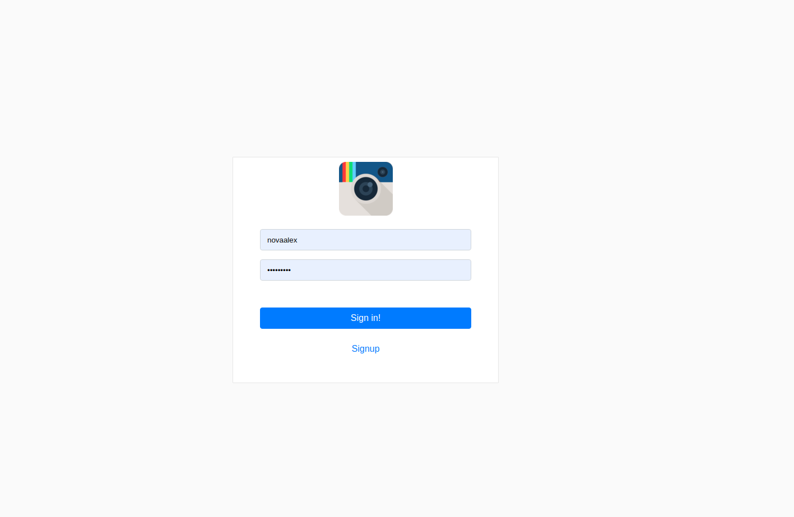
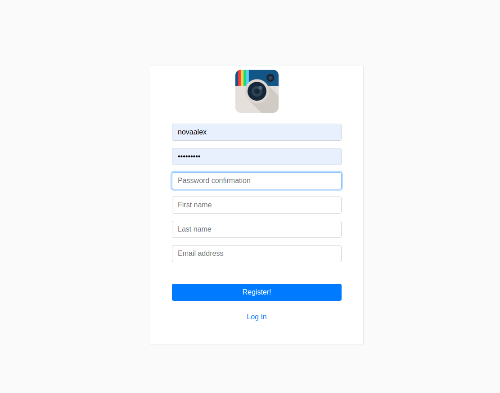
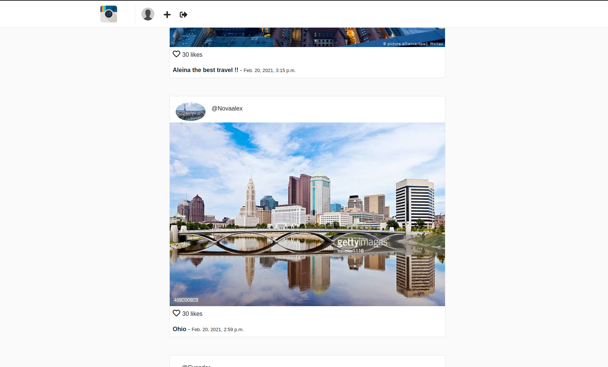
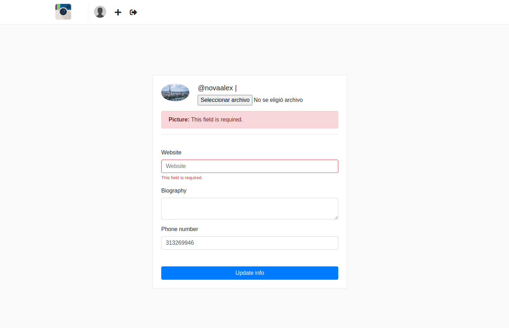
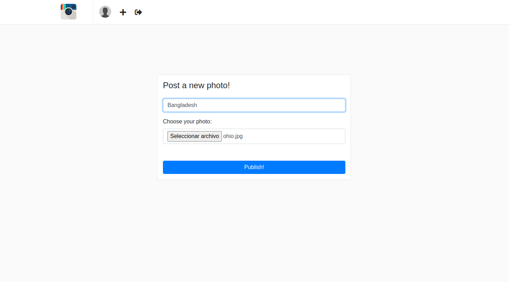
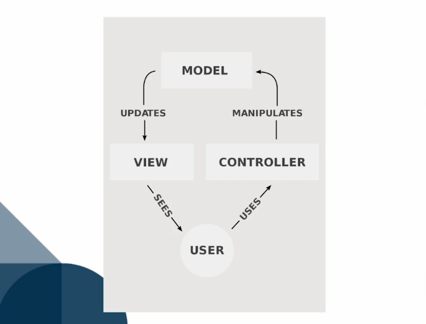
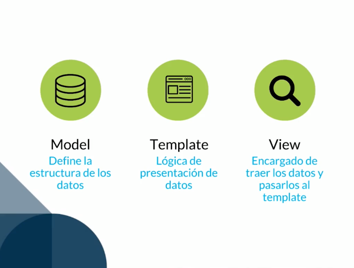

# Django  -> Instagramclon

* python 3.7
* django 3.1.6
* SQLite

## Vistas De la APP

&nbsp;
&nbsp;

&nbsp;
&nbsp;

&nbsp;&nbsp;

&nbsp;&nbsp;

&nbsp;&nbsp;

### Informacion de Django
#### * Modelo MVC normal

&nbsp;
 #### * Modelo MTV de python

&nbsp;
 #### * Midlewares Estructure

